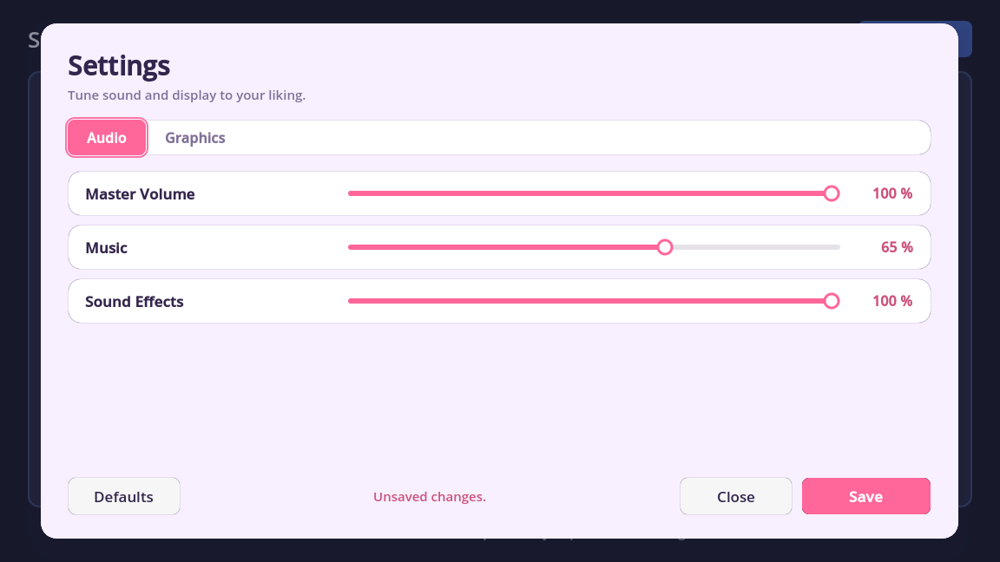
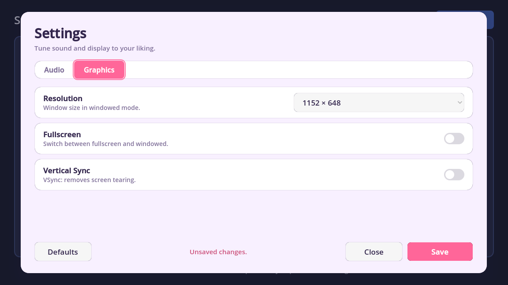
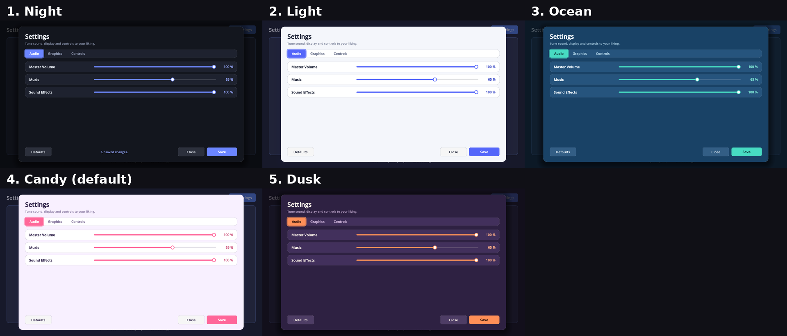

<p align="center"></p>

# Settings Menu Lite for Godot 4

A clean, ready-to-use settings menu for Godot 4.2+. Add it in two minutes and ship your game with proper options.




## Features

- **Audio**: one live slider per audio bus (Master, Music, SFX, or your own buses).
- **Graphics**: resolution, fullscreen / windowed, VSync.
- **Auto save & load**: settings are written to `user://settings.cfg` and re-applied on every launch.
- **Mouse, keyboard and gamepad** navigation.
- **5 colour themes** (Night, Light, Ocean, Candy, Dusk) or your own colours, all from the Inspector.
- **English UI with a built-in French translation**, picked automatically from the player's language.
- **100% typed GDScript**, native Control nodes, no external assets.
- Demo scene included.



## Installation

1. Install from the Godot Asset Library, or copy `addons/settings_menu/` into your project's `addons/` folder.
2. Open **Project > Project Settings > Plugins** and enable **Settings Menu Lite**. The `SettingsManager` autoload is added for you.
3. Try it: open `addons/settings_menu/demo/Demo.tscn` and press **F6**.

## Usage

```gdscript
const SETTINGS_MENU: PackedScene = preload("res://addons/settings_menu/SettingsMenu.tscn")

func _on_settings_button_pressed() -> void:
	var menu: Control = SETTINGS_MENU.instantiate()
	menu.free_on_close = true
	add_child(menu)
```

Full documentation: [addons/settings_menu/README.md](addons/settings_menu/README.md) (French: [README.fr.md](addons/settings_menu/README.fr.md)).

## Need key rebinding?

**[Settings Menu PRO](https://exiforever.itch.io/settings-menu-pro)** adds a full **Controls** tab: keyboard, mouse and gamepad rebinding, conflict detection (Swap / Replace), saved custom bindings and an API for actions created in code. Upgrading is just replacing the folder; your players' saved settings are kept.

## License

MIT. See [LICENSE](LICENSE).
